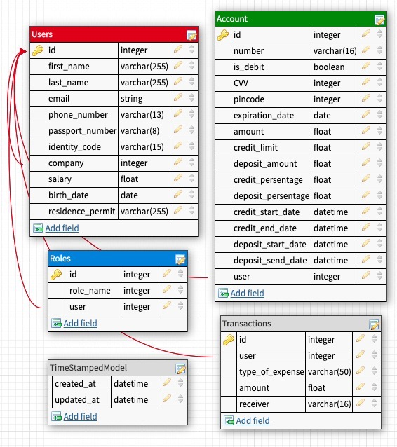

# MiniBank

## Description
This is the source code of our banking system, developed in educational 
purposes.

## Technologies
* Python (3.8)
* PostgreSQL
* Django (3.0.4)
* Docker 

## ER diagram

# Developer info:
  * Python team:
    - @olya_petryshyn
    - @taraskonchak
    - @sikyrynskiy
    - @ement06
